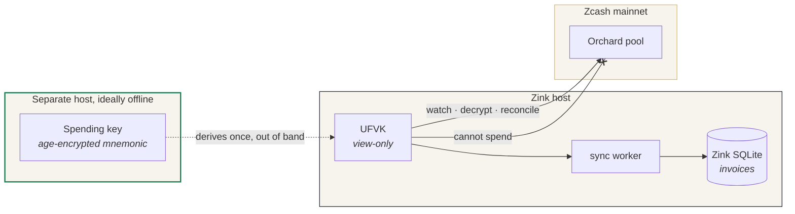
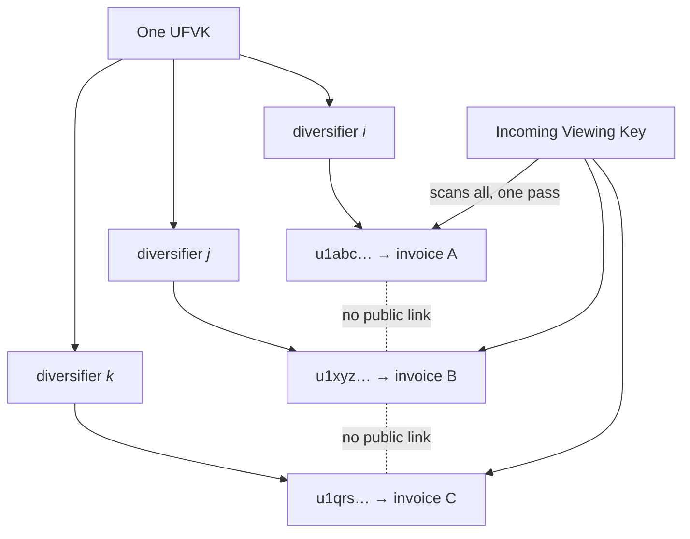
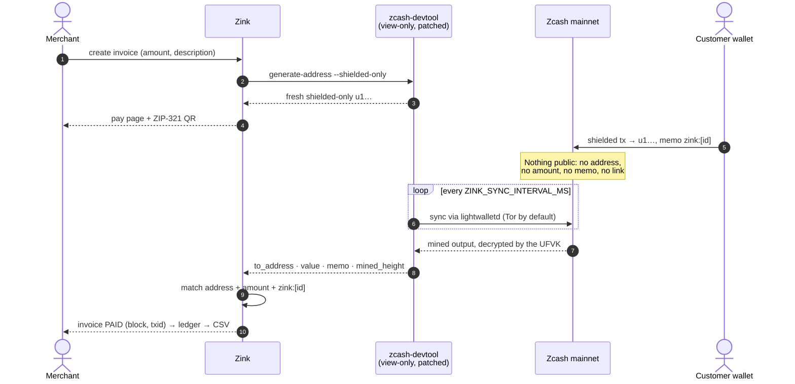

# zink.

**Private Zcash payment links that reconcile themselves.**

[](https://github.com/KaranSinghBisht/zink/actions/workflows/ci.yml)
[](https://zink-zec.vercel.app/)
[](./LICENSE)

Zink lets a merchant create a familiar payment link without publishing a
reusable address. Each invoice gets a fresh shielded-only diversified address,
the customer pays through a ZIP-321 URI, and a view-only wallet marks the right
invoice paid after it is mined. The Zink process can observe incoming payments;
it cannot spend them.

Built for **ZecHub Hackathon 3.0**, Accounting track.

- **Try the UI:** [zink-zec.vercel.app](https://zink-zec.vercel.app/)
- **Run the complete flow:** use Zcash testnet with the guide below

> The hosted Vercel deployment is an explicitly non-payable showcase. Its
> ledger, addresses, transaction state, and QR targets are synthetic because a
> serverless deployment does not run the long-lived wallet sync worker. Run
> Zink beside a view-only wallet for real testnet or mainnet detection.

## In one paragraph

A reusable transparent payment address exposes a merchant's public transaction
graph. Zink instead creates a fresh shielded address per invoice. A Unified Full
Viewing Key lets the merchant server detect and reconcile incoming payments,
while the spending key stays elsewhere. The payment memo carries an encrypted
`zink:<invoice-id>` reference, so the ledger knows which invoice cleared without
placing the reference on the public chain.

## Status, stated plainly

The create, derive, watch, and reconcile paths are implemented, and the view-only
wallet syncs mainnet live. **A cleared payment has not been demonstrated
end-to-end.** The demo recording shows an invoice being created, a fresh shielded
address being derived, and the ledger watching mainnet — not a settlement. No
funded wallet was available before the hackathon deadline, so the detection query
and the `PAID` transition, while implemented and documented below, have not been
proven against a real mined payment.

Everything else in this README describes what the code does. This section
describes what has actually been observed. The two are kept separate on purpose.

## What's implemented, and what's been verified

"Implemented" means the code path exists and is exercised by tests or by hand.
"Verified" means it has been observed working against a real chain.

| Capability | Hosted showcase | Self-hosted | Verified against chain |
|---|---:|---:|---|
| Landing, protocol explainer, responsive invoice UI | Yes | Yes | n/a |
| Sample dashboard and CSV UX | Yes, synthetic | Yes, real data | n/a |
| Build and share a custom invoice preview | Yes, synthetic | Yes | n/a |
| Derive a fresh shielded-only address | Disabled | Yes | **Yes** — real `u1…`/`utest1…` derived from a UFVK |
| ZIP-321 QR/deep link with amount + encrypted memo | Disabled | Yes | Yes — URI built and scannable |
| Sync a view-only wallet against mainnet | Disabled | Yes | **Yes** — syncs live via lightwalletd |
| Detect mined shielded payments | Disabled | Implemented | **No** — never exercised against a mined payment |
| Stamp an invoice `PAID` | Disabled | Implemented | **No** — see [Status](#status-stated-plainly) |
| `main` / `test` network separation | UI defaults to main | Yes | Yes — wrong-network output rejected |
| Merchant authentication | Not needed for synthetic data | Required, fail-closed | Yes — unit tested |

Network handling is explicit end to end: `main` expects `u1…` addresses and
displays `ZEC`; `test` expects `utest1…` addresses and displays `TAZ`. Output
from the wallet backend is rejected if it belongs to the wrong network, and
startup fails if `ZINK_NETWORK` disagrees with the network in the wallet's
`keys.toml`.

## Why Zcash

- **Diversified Unified Addresses ([ZIP-316](https://zips.z.cash/zip-0316))**:
  every invoice can use a unique shielded address without managing a new seed.
- **Unified Full Viewing Keys**: one online process can watch all of those
  addresses, but it has no authority to spend.
- **Encrypted memos ([ZIP-302](https://zips.z.cash/zip-0302))**: the invoice
  reference is readable by the transaction participants, not public observers.
- **Payment URIs ([ZIP-321](https://zips.z.cash/zip-0321))**: address, amount,
  and memo travel in one scannable request.

Zink does not claim that every possible side channel disappears. It removes the
public address-level linkage and public transaction detail that a transparent
payment link creates; merchants must still avoid identifying descriptions,
unsafe hosting, and operational metadata leaks.

## Architecture

### Where the keys live

The whole design reduces to one boundary: the spending key never reaches the
host that serves the payment links.



A compromise of the Zink host exposes payment *metadata* and viewing capability.
It does not move funds, because no key on that host can.

### One key, many unlinkable faces

A single UFVK yields billions of diversified addresses. Each invoice takes a
fresh one, so no two invoices share a public address-level link — yet one
incoming viewing key scans them all in a single pass.



### What happens when someone pays



> The `PAID` transition above is implemented and documented, but has not yet been
> observed against a real mined payment. See [Status, stated plainly](#status-stated-plainly).

The backend is pinned to `zcash/zcash-devtool` commit
`c8322f7e71ae46ab24801a721523ba83b27d911b`. The small patch in
[`patches/zcash-devtool-zink.patch`](./patches/zcash-devtool-zink.patch) adds an
`--shielded-only` address mode (no transparent receiver) and compatibility for a
lightwalletd subtree-root response. CI checks that the patch still applies to
that exact commit.

## Testnet quick start (recommended)

Testnet coins are valueless TAZ, so this is the safe path for a live demo.
Prerequisites: Rust, Node.js 22+, Git, and pnpm 11+.

### 1. Build the pinned wallet backend

```bash
./scripts/bootstrap-devtool.sh
```

The script refuses to overwrite an existing checkout, fetches the exact commit,
applies the reviewed patch, and builds a release binary.

### 2. Create a testnet merchant wallet and a view-only copy

```bash
DEVTOOL=vendor/zcash-devtool/target/release/zcash-devtool

# Spending wallet. Keep this directory and identity away from the Zink host.
$DEVTOOL wallet -w wallets/merchant-test init \
  --name merchant-test \
  --identity wallets/merchant-test.age \
  --network test \
  --server zecrocks

# Copy the printed uviewtest1… UFVK, then import only that key into Zink's wallet.
$DEVTOOL wallet -w wallets/merchant-test list-accounts
$DEVTOOL wallet -w wallets/zink-view-test init-fvk \
  --name zink-view-test \
  --fvk "uviewtest1…" \
  --server zecrocks
```

`init-fvk` infers testnet from the UFVK. Use separate wallet and database
directories for testnet and mainnet; never point both networks at one database.

### 3. Configure and run Zink

```bash
cd web
cp .env.example .env.local
# Set a long random ZINK_ADMIN_TOKEN before starting.
pnpm install --frozen-lockfile
pnpm dev
```

The example configuration starts with `ZINK_NETWORK=test`. Open
`http://localhost:3000`, sign into the ledger with the admin token, and create a
TAZ invoice. Obtain valueless TAZ using the current guidance in the
[Zcash testnet guide](https://zcash.readthedocs.io/en/latest/rtd_pages/testnet_guide.html),
then pay the generated `utest1…` target from a separate testnet spending wallet.
After the transaction is mined and the configured confirmation depth is met,
the invoice should stamp **PAID** and appear in the ledger. This is the step
that has not yet been confirmed against a live payment — if you run it, the
result is worth reporting in an issue either way.

### 4. Pay from a separate testnet wallet

Keep the payer separate from the merchant viewing wallet. Create and fund a
second testnet spending wallet, then use the invoice page's **Copy ZIP-321**
action with the wallet backend's standards-compatible payment command:

```bash
$DEVTOOL wallet -w wallets/payer-test init \
  --name payer-test \
  --identity wallets/payer-test.age \
  --network test \
  --server zecrocks

# Fund an address from this wallet with valueless TAZ, wait for it to become
# spendable, then paste the copied ZIP-321 request below.
$DEVTOOL wallet -w wallets/payer-test generate-address --shielded-only
$DEVTOOL wallet -w wallets/payer-test sync --server zecrocks
$DEVTOOL wallet -w wallets/payer-test pay \
  --identity wallets/payer-test.age \
  --payment-uri 'zcash:utest1…?amount=0.001&memo=…' \
  --server zecrocks
```

The merchant spending wallet, payer spending wallet, and Zink view-only wallet
must use separate directories. Never place a seed phrase, spending key, UFVK,
admin token, or wallet path in a screenshot or recording.

### Mainnet

Use a completely separate wallet directory, set `ZINK_NETWORK=main`, import a
`uview1…` UFVK, and restart. Mainnet is intentionally not the recommended demo
path. Start with a negligible amount and verify backups and permissions first.

## Configuration

| Variable | Meaning | Default |
|---|---|---|
| `ZINK_DEVTOOL_BIN` | Patched wallet binary | required |
| `ZINK_WALLET_DIR` | View-only wallet directory | required for real mode |
| `ZINK_DB_PATH` | Zink invoice database | `<wallet>/zink.sqlite` |
| `ZINK_NETWORK` | `main` or `test` | `main` |
| `ZINK_SERVER` | lightwalletd set (`zecrocks`; `ywallet` is mainnet-only upstream) | `zecrocks` |
| `ZINK_BASE_URL` | Public origin used in shared links | `http://localhost:3000` |
| `ZINK_SYNC_INTERVAL_MS` | Poll interval, 5,000–300,000 ms | `20000` |
| `ZINK_MIN_CONFIRMATIONS` | Required mined confirmations, 1–100 | `1` |
| `ZINK_ADMIN_TOKEN` | Merchant root secret | required whenever a wallet is configured |
| `ZINK_TRUST_PROXY` | Trust one sanitizing reverse proxy for client IPs | `0` |
| `ZINK_DEBUG` | Verbose server logs | `0` |

Generate the admin token with a password manager or, for example,
`openssl rand -base64 32`. Zink exchanges it for a signed, HttpOnly, SameSite
session that expires after 12 hours; the root token is not stored in the cookie.

## Security model

- The application process receives a **UFVK only**, never a spending key.
- A compromised Zink host can expose private payment metadata and viewing
  capability. It should not be able to move funds.
- Real-wallet mode refuses merchant access if `ZINK_ADMIN_TOKEN` is absent.
- Public status responses exclude addresses, descriptions, and decrypted memos.
- Invoice settlement requires a mined output and the configured confirmations.
- Amounts use integer zatoshis and are bounded by Zcash's monetary range.
- CSV values are neutralized against spreadsheet-formula injection.
- Security headers deny framing, sniffing, and broad browser capabilities.
- Rate limiting ignores caller-supplied forwarding headers unless one trusted
  reverse proxy is explicitly configured.

The upstream `zcash-devtool` project explicitly describes itself as a
prototyping tool and **not production-ready**. Zink is therefore a strong
hackathon prototype, not audited production payment infrastructure. A production
release should replace/harden that boundary, add a shared rate-limit store,
encrypted-at-rest merchant data, backups, monitoring, and an independent audit.

## Development

```bash
cd web
pnpm lint
pnpm test     # network, auth, settlement, and showcase-safety coverage
pnpm build
pnpm audit --prod
```

CI also verifies the upstream wallet patch against its pinned commit. The web
app uses Next.js 16, React 19, TypeScript, Tailwind CSS, SQLite, and Three.js
with a CSS fallback when WebGL or motion is unavailable.

## Current limitations

- Single merchant and a single long-lived Node process per instance.
- SQLite and in-memory rate limits are not suitable for multi-replica hosting.
- Settlement waits for mining; there is no mempool “pending” state.
- Partial/overpayments, refunds, fiat conversion, webhooks, and checkout embeds
  are not implemented.
- The hosted showcase demonstrates product UX only, not live chain integration.
  A self-hosted run against a view-only wallet is the only path that exercises
  real detection.
- Settlement has not been observed end-to-end against a mined payment. See
  [Status, stated plainly](#status-stated-plainly).

## License and credits

[MIT](./LICENSE). Built on
[zcash-devtool](https://github.com/zcash/zcash-devtool),
[librustzcash](https://github.com/zcash/librustzcash), the Zcash ZIPs, and
lightwalletd infrastructure provided through the upstream server sets. Thanks
to ZecHub for the hackathon.
